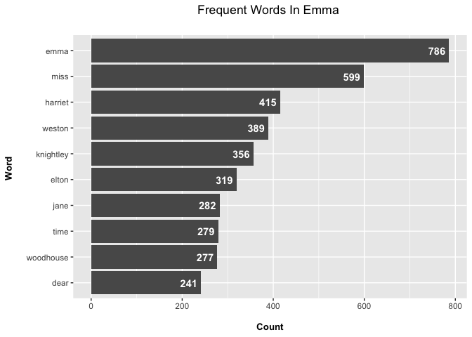
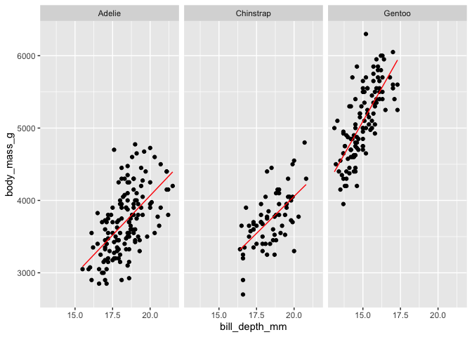

Assignment b04
================
Xiao Hu
2022-12-04

``` r
library(tidyverse)
```

    ## ── Attaching packages ─────────────────────────────────────── tidyverse 1.3.1 ──

    ## ✔ ggplot2 3.4.0      ✔ purrr   0.3.5 
    ## ✔ tibble  3.1.8      ✔ dplyr   1.0.10
    ## ✔ tidyr   1.2.0      ✔ stringr 1.4.0 
    ## ✔ readr   2.1.2      ✔ forcats 0.5.1

    ## ── Conflicts ────────────────────────────────────────── tidyverse_conflicts() ──
    ## ✖ dplyr::filter() masks stats::filter()
    ## ✖ dplyr::lag()    masks stats::lag()

``` r
library(tidytext)
library(janeaustenr)
library(palmerpenguins)
library(purrr)
library(testthat)
```

    ## 
    ## Attaching package: 'testthat'

    ## The following object is masked from 'package:dplyr':
    ## 
    ##     matches

    ## The following object is masked from 'package:purrr':
    ## 
    ##     is_null

    ## The following objects are masked from 'package:readr':
    ## 
    ##     edition_get, local_edition

    ## The following object is masked from 'package:tidyr':
    ## 
    ##     matches

# Exercise 1 (37.5 points)

Take a Jane Austen book contained in the `janeaustenr` package, or
another book from some other source, such as one of the many freely
available books from Project Gutenberg (be sure to indicate where you
got the book from). Make a plot of the most common words in the book,
removing “stop words” of your choosing (words like “the”, “a”, etc.) or
stopwords from a pre-defined source, like the stopwords package or
`tidytext::stop_words`.

``` r
# tibble aka neater data frame
emma_df <- data_frame(Text = emma) 
```

    ## Warning: `data_frame()` was deprecated in tibble 1.1.0.
    ## ℹ Please use `tibble()` instead.

``` r
# picks out the individual words and places them as rows
emma_words <- emma_df %>% 
                  unnest_tokens(output = word, input = Text) 
# remove stopwords
emma_words <- emma_words %>%
                   anti_join(stop_words, by = "word") 
# counts of the words
emma_wordcounts <- emma_words %>% count(word, sort = TRUE)

# top 10 words with highest frequency
top_10 <- emma_wordcounts %>% 
  arrange(desc(n)) %>% 
  head(10) 

# plot
top_10 %>% 
    ggplot(aes(reorder(word,n), n)) + 
    geom_col() +
    coord_flip() +
    labs(x = "Word \n", y = "\n Count ", title = "Frequent Words In Emma \n") +
    geom_text(aes(label = n), hjust = 1.2, colour = "white", fontface = "bold") +
    theme(plot.title = element_text(hjust = 0.5), 
        axis.title.x = element_text(face="bold", size = 10),
        axis.title.y = element_text(face="bold", size = 10))
```

<!-- -->

# Exercise 2 (37.5 points)

Make a function that converts words to your own version of Pig Latin.

``` r
#' Converts one word to the version of Pig Latin
#'
#' For words that begin with consonant sounds, all letters before the initial vowel are reversed.
#' If the last letter is a consonant sound, then add "y" to the end of the word, 
#' otherwise, add "e" to the end of the word.
#'
#' @param word a string
#' @return A string
#' @examples
#' pig_latin("ieuoaords")
#' pig_latin("posdhla")
#' 
#' @export


pig_latin <- function(word){
  
  stopifnot(is.character(word))
  #For words that begin with consonant sounds, all letters before the initial vowel are reversed
  list = c("a","e","i","o","u")
  i = 1
  while (i <= nchar(word) & (substr(word,i,i) %in% list) ){
    i = i+1
    
  }
  if (i > 1){
    cons = substr(word,1,i-1)
    splits <- strsplit(cons, "")[[1]]
    reversed <- rev(splits)
    reversed_cons <- paste(reversed, collapse = "")
    pig_latin <- str_c(reversed_cons, str_sub(word,i))
  }else{
    pig_latin <- word
  }
  
  #If the last letter is consonant sounds, then add "y" to the end of the word, 
  #otherwise, add "e" to the end of the word.
  if (str_sub(pig_latin,-1) %in% list){
    pig_latin <- str_c(pig_latin,"y")
  }else{
    pig_latin <- str_c(pig_latin,"e")
  }
  
  return(pig_latin)  
}
```

``` r
test_that("Testing pig_latin function", {
  expect_equal(pig_latin("lihjgka"),"lihjgkay")
  expect_equal(pig_latin("aeojgka"),"oeajgkay")
  expect_match(pig_latin("ljgk"), 'ljgke')
  expect_error(pig_latin(1), "is.character")
})
```

    ## Test passed 🎉

# Exercise 3 (37.5 points)

For this exercise, you’ll be evaluating a model that’s fit separately
for each group in some dataset. You should fit these models with some
question in mind.

In this exercise, I will use `penguins` as my dataset to investigate the
relationship between bill depth and body mass across different species.

``` r
penguins <- na.omit(penguins)
head(penguins)
```

    ## # A tibble: 6 × 8
    ##   species island    bill_length_mm bill_depth_mm flipper_l…¹ body_…² sex    year
    ##   <fct>   <fct>              <dbl>         <dbl>       <int>   <int> <fct> <int>
    ## 1 Adelie  Torgersen           39.1          18.7         181    3750 male   2007
    ## 2 Adelie  Torgersen           39.5          17.4         186    3800 fema…  2007
    ## 3 Adelie  Torgersen           40.3          18           195    3250 fema…  2007
    ## 4 Adelie  Torgersen           36.7          19.3         193    3450 fema…  2007
    ## 5 Adelie  Torgersen           39.3          20.6         190    3650 male   2007
    ## 6 Adelie  Torgersen           38.9          17.8         181    3625 fema…  2007
    ## # … with abbreviated variable names ¹​flipper_length_mm, ²​body_mass_g

1.  Make a column of model objects. Do this using the appropriate
    mapping function from the purrr package. Note: it’s possible you’ll
    have to make use of nesting, here.

``` r
models <- penguins %>% 
            nest(data = -species) %>% 
            mutate(
              model = map(data, 
                          function(df) lm(body_mass_g ~ bill_depth_mm,
                                data = df)
                          )
            )
models
```

    ## # A tibble: 3 × 3
    ##   species   data               model 
    ##   <fct>     <list>             <list>
    ## 1 Adelie    <tibble [146 × 7]> <lm>  
    ## 2 Gentoo    <tibble [119 × 7]> <lm>  
    ## 3 Chinstrap <tibble [68 × 7]>  <lm>

I fitted a linear regression with body mass as response variable and
bill depth as explanatory variable for each species.

2.  Evaluate the model in a way that interests you. But, you should
    evaluate something other than a single number for each group. Hint:
    you’ll need to use another purrr mapping function again.

``` r
models <- models %>% 
            mutate(
                pred = map(.x = model, ~predict(.x)),
                beta_bill_depth = map_dbl(.x = model, ~coef(.x)['bill_depth_mm']),
                significance = map_dbl(.x = model, ~glance(.x) %>% pull(p.value))
                )
```

I extracted coefficient of bill_depth and its p-value in each model to
check whether there are any differences between coefficients among
different species and whether all the coefficients are significant.
Moreover, I also predicted body mass using the fitted linear regression
model, and the values are stored in a tibble for each species.

3.  Print out this intermediate tibble for inspection (perhaps others as
    well, if it makes sense to do so).

``` r
models
```

    ## # A tibble: 3 × 6
    ##   species   data               model  pred        beta_bill_depth significance
    ##   <fct>     <list>             <list> <list>                <dbl>        <dbl>
    ## 1 Adelie    <tibble [146 × 7]> <lm>   <dbl [146]>            218.     1.67e-14
    ## 2 Gentoo    <tibble [119 × 7]> <lm>   <dbl [119]>            368.     1.64e-20
    ## 3 Chinstrap <tibble [68 × 7]>  <lm>   <dbl [68]>             205.     4.79e- 8

All coefficients are positive and significant. Gentoo has the largest
coefficient, which indicates that one unit change in bill depth is
associated with the most changes in body mass (369.44g).

4.  Unnest the resulting calculations, and print your final tibble to
    screen. Make sure your tibble makes sense: column names are
    appropriate, and you’ve gotten rid of columns that no longer make
    sense.

``` r
unnest_t <- models %>% select(-model) %>% unnest(cols = c(data,pred)) %>% select(species,bill_depth_mm,body_mass_g,pred,beta_bill_depth,significance)
unnest_t
```

    ## # A tibble: 333 × 6
    ##    species bill_depth_mm body_mass_g  pred beta_bill_depth significance
    ##    <fct>           <dbl>       <int> <dbl>           <dbl>        <dbl>
    ##  1 Adelie           18.7        3750 3783.            218.     1.67e-14
    ##  2 Adelie           17.4        3800 3499.            218.     1.67e-14
    ##  3 Adelie           18          3250 3630.            218.     1.67e-14
    ##  4 Adelie           19.3        3450 3914.            218.     1.67e-14
    ##  5 Adelie           20.6        3650 4198.            218.     1.67e-14
    ##  6 Adelie           17.8        3625 3587.            218.     1.67e-14
    ##  7 Adelie           19.6        4675 3980.            218.     1.67e-14
    ##  8 Adelie           17.6        3200 3543.            218.     1.67e-14
    ##  9 Adelie           21.2        3800 4329.            218.     1.67e-14
    ## 10 Adelie           21.1        4400 4307.            218.     1.67e-14
    ## # … with 323 more rows

5.  Produce a plot communicating something about the result.

``` r
unnest_t %>% ggplot(aes(y = body_mass_g,x = bill_depth_mm)) + 
  geom_point() + 
  geom_line(aes(y = pred), color = "red") +
  facet_wrap(~species)
```

<!-- -->

The red lines represent predicted value by linear regression models. It
is clear that the linear model fits data well for all species, and there
are differences in association between bill depth and body mass across
different species. Gentoo has the steepest slope, while slope in Adelie
and Chinstrap are similar.
